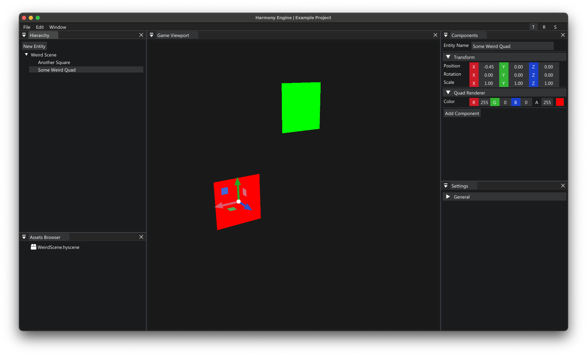

# HarmonyEngine

*Harmony Engine* is a **3D game engine** with a **basic 3D game editor** that can be used to **develop games**.


<p align="center"><i>Image of Harmony Engine v0.2.0 (Jul 25, 2021)</i></p>

<br />

Currently *Harmony Engine* is begin developed on MacOS however, with a few quick adjustments it should be able to run on Windows 10 as well. *(Windows support coming soon)!!!*

#### Short-Term Goals
* Editor Mouse Picking
* Drag and Drop Assets Functionality
* Integration with Operating System *(eg. file recognition, etc.)*
* Editor Undo/Redo System
* Engine Runtime
* Lua Scripting

#### Long-Term Goals
* Compile *Harmony Engine/Editor* to a Window Executable File.
* Audio Support
* Ability to work with external applications. *(eg. Blender, Maya, Photoshop, etc.)*
* Ability to compile a Harmony Project into a native executable. *(meaning you will be able to run your project outside of Harmony Engine)* 

---

## Quick Links

1. [Changelog](CHANGELOG.md)
1. [Cloning and Building Project](#cloning-and-building-project)
1. [Generating Changelog](#generating-the-changelog)
1. [How to Contribute](#how-to-contribute)

---

## Cloning and Building Project

1. [Mac Instructions](#getting-started-with-mac)
2. [Windows 10 Instructions](#getting-started-with-windows)
3. [Linux Instructions](#getting-started-with-linux)

### Getting Started With Mac

**1. Clone the Repository** - *Make sure you have git command line tools installed! (on MacOS simply running `git` in terminal will prompt its installation)*
```shell
git clone git@github.com:Nick-Fanelli/HarmonyEngine.git --recursive
```
***Note: Use flag --recursive to get access to the submodules***

**2. Installing CMake**

* Make sure [Homebrew](https://brew.sh/) is installed (if so skip this step)
    ```shell
    /bin/bash -c "$(curl -fsSL https://raw.githubusercontent.com/Homebrew/install/HEAD/install.sh)"
    ```

* Install, CMake
    ```shell
    brew install cmake
    ```
**3. Building the Project**

* Navigate to `HarmonyEngine/build` directory; or create it.
* Build project with **CMake**
    ```shell
    cmake ..
    ```
**4. Build and Run The C++ Code**

* Run the Makefile
    ```shell
    make
    ```
* Run the Executable
    ```shell
    ./HarmonyEditor/HarmonyExecutable
    ```

    ***Note: Make sure you run the executable from the build directory!***
---

### Getting Started with Windows

Getting started instructions for Windows coming soon...

---

### Getting Started with Linux

Getting started instructions for Linux coming soon...

---

## Generating the Changelog

**1. Make sure that [NPM](https://www.npmjs.com/) command line tools are installed**<br>
**2. Get the needed dependencies**
* Run the following command in the root directory of the project
```shell
npm install
```
**3. Create the version/change-log commit**
* Run the following command in the root directory of the project *(Replace {TARGET_VERSION_TAG} with the version tag. eg. v1.0.0)*
**Note: Please use the vX.X.X format when tagging versions ***(eg. v1.0.0, v0.1.0, v1.0.2)*****
```shell
npm run release -- --release-as {TARGET_VERSION_TAG}
```
**4. Push the new tag/version**
* Run the following command in the root directory of the project
```shell
git push --follow-tags
```

---

## How to Contribute

No contributions currently needed!
Instructions Coming soon...
*Follow the repo for alerts*
